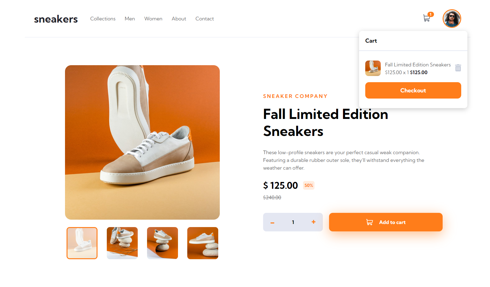
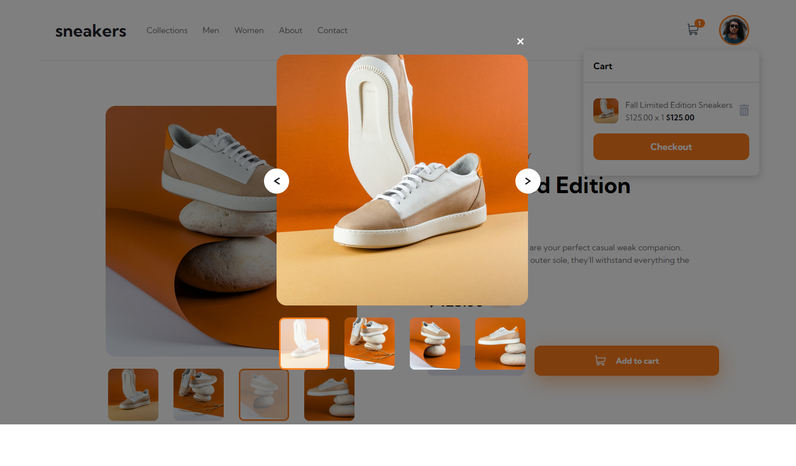
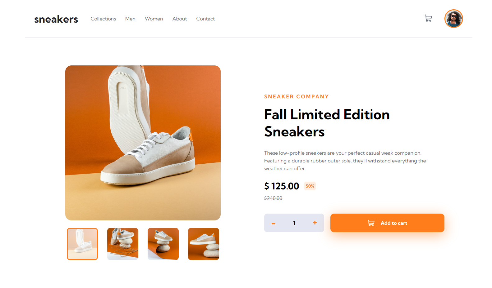

# Frontend Mentor - E-commerce product page solution

This is a solution to the [E-commerce product page challenge on Frontend Mentor](https://www.frontendmentor.io/challenges/ecommerce-product-page-UPsZ9MJp6). Frontend Mentor challenges help you improve your coding skills by building realistic projects.

### The challenge

Users should be able to:

- View the optimal layout for the site depending on their device's screen size
- See hover states for all interactive elements on the page
- Open a lightbox gallery by clicking on the large product image
- Switch the large product image by clicking on the small thumbnail images
- Add items to the cart
- View the cart and remove items from it

### Screenshot

I am thrilled to present to you my masterpiece - a screenshot of my solution to the e-commerce product page! It was an absolute blast putting this together, and I couldn't be more excited to share it with you.

As you can see from the screenshot, I've poured all of my heart and soul into creating a product page that is not only visually stunning but also highly functional and user-friendly. Every element on the page has been carefully curated to ensure that it seamlessly guides the user towards making a purchase.

From the captivating product images to the sleek and intuitive navigation, I've left no stone unturned in my quest to create the ultimate product page. And let me tell you, it was no easy feat! But with a lot of perseverance and a healthy dose of creativity, I managed to pull it off.

So without further ado, I present to you my solution to the e-commerce product page challenge. Take a look, and let me know what you think!

- Live Site URL: [e-commerce-product-page](https://e-commerce-product-page-alpha.vercel.app/)

### Built with

- Semantic HTML5 markup
- CSS custom properties
- SASS/SCSS
- [React](https://reactjs.org/) - JS library

## Author

- Website - [Jownsu](https://jownsu.github.io/)
- Frontend Mentor - [@jownsu](https://www.frontendmentor.io/profile/jownsu)
- Instagram - [jownsu](https://www.instagram.com/jownsu/)
- Linked In - [Jhones](https://www.linkedin.com/in/jhones-digno-866904213/)